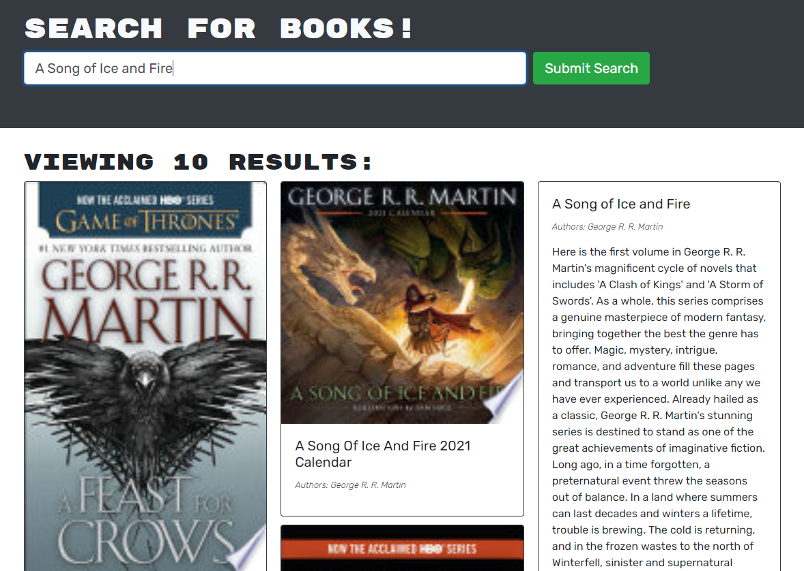

# Google Book Search

## Description

This site allows users to create an account, search for books from the Google Books Site and save books to a private list with all of the data populated from Google.

## Screenshot

## Table of Contents 

* [Installation](#installation)
* [Usage](#usage)
* [Demo](#demo)

## Installation

Clone the project, run `npm install` in the server, client and root directories. Then from the root directory run `npm start`

## Usage

Sign Up by entering your username, email and password. Search for books by entering info into the search input. If you like, add a book to your saved books by clicking the save button on the result. Navigate to your saved books page to view your private book list.

## Demo

A working deployment can be found at https://bluesatyr-book-search.herokuapp.com/
    
## Questions

For additional information on this project contact me by email at shawnevans.music@gmail.com or visit my GitHub page at https://github.com/bluesatyr.